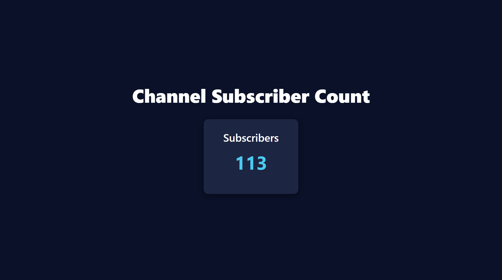

```jsx
import { useEffect, useState } from "react";

export default function SubscriberCountUI() {

  // state to manage subscriber
  const [subscriber, setSubscriber] = useState(0);

  // function for incrementing the subscriber 

  useEffect(() => {
    const id = setInterval(() => {
      setSubscriber(prev => prev + 1); // always gets latest value
    }, 1000);

    return () => clearInterval(id); // cleanup
  }, []);


  return (
    <div
      style={{
        minHeight: "100vh",
        background: "#0A1128",
        color: "white",
        display: "flex",
        flexDirection: "column",
        alignItems: "center",
        justifyContent: "center",
        gap: "25px",
        textAlign: "center",
        padding: "20px"
      }}
    >
      <h1 style={{ fontSize: "3rem", fontWeight: "800" }}>
        Channel Subscriber Count
      </h1>

      <div
        style={{
          background: "#1C2541",
          padding: "30px 50px",
          borderRadius: "12px",
          boxShadow: "0 4px 15px rgba(0,0,0,0.4)"
        }}
      >
        <h2 style={{ fontSize: "1.7rem", marginBottom: "10px" }}>Subscribers</h2>

        {/* You will replace "00000" with your dynamic subs count */}
        <p style={{ fontSize: "3rem", fontWeight: "bold", color: "#4CC9F0" }}>
          {subscriber}
        </p>
      </div>
    </div>
  );
}


```