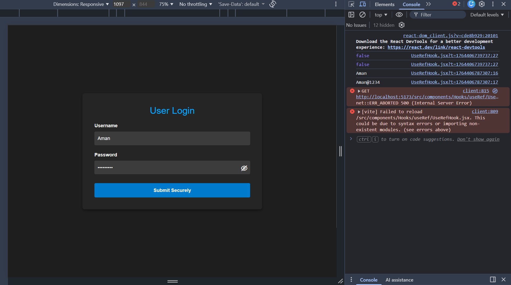

# 📘 useRef Hook – Complete Guide (Simple → Production-Level)

## ⭐ What is useRef?
`useRef` is a React Hook used to:
1. Access **DOM elements directly**
2. Store **mutable values** (like variables) that do **NOT cause re-render**
3. Create **references** that persist across renders
4. Store **previous values**, timers, or counters

---

# 1️⃣ Syntax

```jsx
const refName = useRef(initialValue);
```

### 🔍 Explanation

* `refName.current` holds the actual value.
* Changing `.current` **does NOT cause re-renders** (unlike useState).
* Useful for DOM access, timers, previous state tracking, and avoiding re-renders.

---

# 2️⃣ Simple Example — Access an Input Field

```jsx
import { useRef } from "react";

function App() {
  const inputRef = useRef(null);

  const focusInput = () => {
    inputRef.current.focus();
  };

  return (
    <>
      <input ref={inputRef} type="text" placeholder="Type here..." />
      <button onClick={focusInput}>Focus Input</button>
    </>
  );
}

export default App;
```

### 🤔 What’s happening?

* `inputRef.current` stores the `<input>` element
* `focusInput()` directly focuses the input without re-rendering

---

# 3️⃣ Example — Storing Values Without Re-rendering

```jsx
function Counter() {
  const countRef = useRef(0);

  const increase = () => {
    countRef.current += 1;
    console.log("Value:", countRef.current);
  };

  return (
    <>
      <button onClick={increase}>Increase</button>
    </>
  );
}
```

### 🔍 Why useRef?

* If we used useState, UI re-renders every time
* Here we store value **without re-rendering**

---

# 4️⃣ Example — Tracking Previous State Value

```jsx
import { useEffect, useRef, useState } from "react";

function PreviousValue() {
  const [count, setCount] = useState(0);
  const prevCount = useRef();

  useEffect(() => {
    prevCount.current = count;
  });

  return (
    <>
      <h3>Current: {count}</h3>
      <h3>Previous: {prevCount.current}</h3>

      <button onClick={() => setCount(count + 1)}>Increase</button>
    </>
  );
}
```

---

# 5️⃣ Example — useRef for Timers (setInterval)

```jsx
import { useRef, useState } from "react";

function Timer() {
  const [count, setCount] = useState(0);
  const timerRef = useRef(null);

  const startTimer = () => {
    if (timerRef.current) return;

    timerRef.current = setInterval(() => {
      setCount((prev) => prev + 1);
    }, 1000);
  };

  const stopTimer = () => {
    clearInterval(timerRef.current);
    timerRef.current = null;
  };

  return (
    <>
      <h2>{count}</h2>
      <button onClick={startTimer}>Start</button>
      <button onClick={stopTimer}>Stop</button>
    </>
  );
}

export default Timer;
```

### 🔍 Why useRef?

* `.current` holds the interval id
* Updating it won't cause re-renders
* Best way to store timers

---

# 6️⃣ Real Production Example — Scroll to Section

```jsx
import { useRef } from "react";

function Page() {
  const aboutRef = useRef(null);

  const scrollToAbout = () => {
    aboutRef.current.scrollIntoView({ behavior: "smooth" });
  };

  return (
    <>
      <button onClick={scrollToAbout}>Go to About</button>

      <section style={{ height: "100vh" }}></section>

      <section ref={aboutRef}>
        <h2>About Section</h2>
      </section>
    </>
  );
}

export default Page;
```

---

# 7️⃣ Production Use Case — Form Submit Without State

```jsx
function SubmitForm() {
  const nameRef = useRef();
  const emailRef = useRef();

  const handleSubmit = () => {
    const data = {
      name: nameRef.current.value,
      email: emailRef.current.value
    };
    console.log(data);
  };

  return (
    <>
      <input ref={nameRef} placeholder="Name" />
      <input ref={emailRef} placeholder="Email" />

      <button onClick={handleSubmit}>Submit</button>
    </>
  );
}
```

### ✔ No need for useState for every input

### ✔ Faster and simpler for non-reactive fields

---

# 8️⃣ useRef vs useState (Important Table)

| Feature                     | useState | useRef |
| --------------------------- | -------- | ------ |
| Triggers re-render          | ✔ Yes    | ❌ No   |
| Stores mutable values       | ❌ No     | ✔ Yes  |
| Best for DOM elements       | ❌ No     | ✔ Yes  |
| Best for performance tuning | ❌ No     | ✔ Yes  |
| Updates visible in UI       | ✔ Yes    | ❌ No   |

---

# 9️⃣ When Should You Use useRef?

### ✔ When you need to:

* Access DOM elements
* Store previous value
* Hold intervals or timeouts
* Track values without triggering re-renders
* Manage focus, scroll, animations
* Improve performance
* Build component libraries

### ❌ Don't use useRef for:

* UI-related state
* Anything requiring a re-render

---

# 🔥 Interview Questions

### ❓ What is useRef?

A hook used to store mutable values that persist across renders without causing re-renders.

### ❓ useRef vs useState?

* `useState` → re-renders UI
* `useRef` → stores values silently

### ❓ Can useRef hold a DOM element?

Yes. That is one of its main uses.

### ❓ Does updating ref cause re-render?

No.

### ❓ Why is useRef used for timers?

Because timer IDs don’t need to re-render UI.

### ❓ Can we use useRef to store previous value?

Yes, by updating `.current` inside `useEffect`.

---