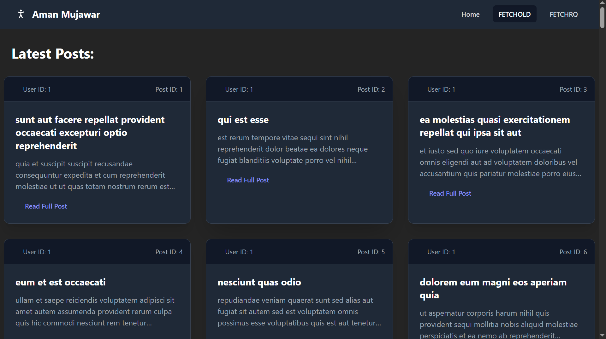

# 🚀 **What Is React Query (TanStack Query)?**

---



---
👉 **React Query is a data-fetching library for React.**
It helps you:

* Fetch API data
* Cache the data (store & reuse API responses)
* Prevent unnecessary API calls
* Show loading states automatically
* Handle errors automatically
* Refetch data automatically
* Synchronize UI with server state

### 🔥 Simple definition:

**React Query makes API calls super easy, fast, and optimized — without writing too much code.**

---

# 🎯 Why Do We Need React Query?

Without React Query (using normal `useEffect`):

* You write too much boilerplate
* Handling loading/error is manual
* Caching is difficult
* Refetching is manual
* State management becomes complex

With React Query:

* Caching is automatic
* Refetching is automatic
* Parallel queries? Simple
* Optimistic updates? Simple
* No need to write useState/useEffect for API calls

---

# ⭐ **Core Concept: Query**

A **query** = "Get some data from server"

Every query has 2 things:

## 1️⃣ **queryKey**

```js
queryKey: ["posts"]
```

* Unique identifier for the data
* Helps React Query know if it should fetch or return cached data
* ALWAYS AN ARRAY

✔️ Example:

* `["users"]`
* `["posts", id]`
* `["todos", pageNumber]`

---

## 2️⃣ **queryFn**

```js
queryFn: fetchUsers
```

* The **function that actually fetches data**
* Must return a promise
* Should be async

---

# 🔥 **Basic Syntax (useQuery)**

```js
const { data, isLoading, isError, error } = useQuery({
  queryKey: ["users"],
  queryFn: fetchUsers
});
```

---

# 🧩 **All Important useQuery Properties (Explained Clearly)**

Below is **EVERY PROPERTY** you might ever use in React Query.

---

# 1️⃣ **queryKey**

Unique key for caching.

```js
queryKey: ["products", categoryId]
```

---

# 2️⃣ **queryFn**

The function that fetches data.

```js
queryFn: async () => {
  const res = await fetch("/api/products");
  return res.json();
}
```

---

# 3️⃣ **enabled**

If `false`, the query will NOT run automatically.

Useful for:

* Fetching after button click
* Fetching after some state exists
* Fetching only if user is logged in

```js
enabled: false
```

Example:

```js
const { data } = useQuery({
  queryKey: ["user", id],
  queryFn: fetchUser,
  enabled: !!id  // run only when id exists
});
```

---

# 4️⃣ **staleTime**

How long the data is considered "fresh".

Default: 0 ms (always stale)

If staleTime = 5 minutes → No refetch for 5 mins

```js
staleTime: 1000 * 60 * 5
```

---

# 5️⃣ **cacheTime**

How long unused data stays in cache before being garbage-collected.

```js
cacheTime: 1000 * 60 * 10
```

---

# 6️⃣ **refetchOnWindowFocus**

When you switch browser tabs and return, should it refetch?

```js
refetchOnWindowFocus: true | false | "always"
```

Useful in dashboards → always show updated info.

---

# 7️⃣ **refetchInterval**

Auto-refetch every X milliseconds.

```js
refetchInterval: 3000 // every 3 seconds
```

Useful for:

* Live data
* Crypto prices
* Stock prices

---

# 8️⃣ **retry**

How many times to retry if API fails.

```js
retry: 3
retry: false // disable retries
```

---

# 9️⃣ **select**

Transform data before returning.

```js
select: (data) => data.slice(0, 5)
```

Example: return first 5 posts only.

---

# 1️⃣0️⃣ **placeholderData**

Temporary data while loading.

```js
placeholderData: []
```

---

# 1️⃣1️⃣ **initialData**

Used when you already have some data (SSR or previous page)

```js
initialData: () => cachedUser
```

---

# 📌 **Complete Example (All important properties)**

```jsx
const { data, isLoading, isError, refetch } = useQuery({
  queryKey: ["posts"],
  queryFn: fetchPosts,
  enabled: true,
  staleTime: 5 * 60 * 1000,
  cacheTime: 10 * 60 * 1000,
  retry: 2,
  refetchOnWindowFocus: false,
  refetchInterval: false,
  select: (data) => data.filter(post => post.userId === 1),
});
```

---

# 🚀 EXTRA IMPORTANT: QueryClient

### MUST wrap your app:

```jsx
import { QueryClient, QueryClientProvider } from "@tanstack/react-query";

const client = new QueryClient();

root.render(
  <QueryClientProvider client={client}>
    <App />
  </QueryClientProvider>
);
```

---

# ⭐ Advanced Features You Must Know

## 1. **invalidateQueries**

Manually refetch a query:

```js
queryClient.invalidateQueries(["posts"]);
```

Useful after POST/PUT/DELETE.

---

## 2. **useMutation**

For POST, PUT, DELETE operations.

```js
const mutation = useMutation({
  mutationFn: addUser,
  onSuccess: () => {
    queryClient.invalidateQueries(["users"]);
  }
});
```

---

# 🎯 When to Use React Query?

Use when:

* App fetches data from APIs
* Data changes frequently
* You want caching
* You want easy loading/error handling
* You want auto-refetching
* You want background updates

Perfect for:

* MERN apps
* Dashboards
* Product listings
* Admin panels

---

# 🏆 Final Summary (In Simple Words)

### ⚡ React Query:

* Fetches data
* Caches data
* Refetches automatically
* Handles loading/error states
* Prevents unnecessary API calls
* Makes server state management easy

### ⚡ useQuery:

* queryKey → Name of data
* queryFn → Function that fetches API
* enabled → run or not
* staleTime → valid time
* retry → retry on failure
* select → modify data
* refetch → refresh manually

---